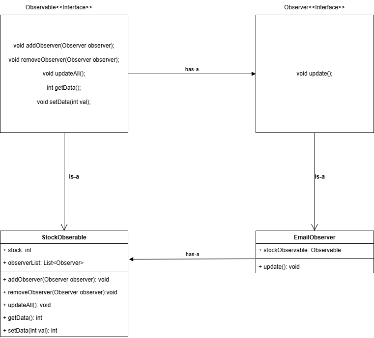

## OBSERVER PATTERN
---

**Pattern Category**: 
Behavioral Pattern

This pattern contains one or more observers and an observable. The observer keeps on observing the observable and when there is an update of state of the observable then all the observers are notified. 
 
**Analogy**: 
Observer is like a newspaper customer and observable is the printing press. Whenever there is a new edition of newspaper available it is distributed among the customers. Similarly whenever there is an update in the state of observable then all the observers are updated. 

**UML Diagram**
---
